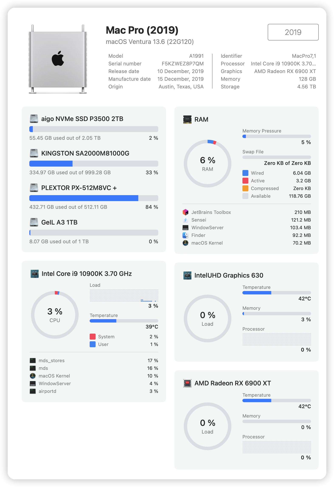

## Rog-STRIX-Z590-A-Gaming-WIFI-II-Hackintosh

Install macOS Ventura on [ORG Z590-A Gaming Wifi II](https://rog.asus.com/motherboards/rog-strix/rog-strix-z590-a-gaming-wifi-ii-model/) Mainboard with 10th Gen Intel CPU.



---

### Information 

- macOS: [Ventura](https://www.apple.com/macos/ventura/)
- bootloader: [OpenCore 0.9.3](https://github.com/acidanthera/OpenCorePkg/releases/tag/0.9.3)

---


### Hardware

| Component    | Variant                   | Link                                                                                                                                         |
|:------------:|:-------------------------:|:--------------------------------------------------------------------------------------------------------------------------------------------:|
| Mainboard    | ORG Z590-A Gaming Wifi II | [www.asus.com](https://rog.asus.com/motherboards/rog-strix/rog-strix-z590-a-gaming-wifi-ii-model/)                                           |
| Processor    | Intel Core i9 10900K      | [ark.intel.com](https://ark.intel.com/content/www/us/en/ark/products/199332/intel-core-i910900k-processor-20m-cache-up-to-5-30-ghz.html)     |
| DDR4 RAM     | Corsair 128GB   | [www.corsair.com](https://www.corsair.com/ja/zh/%E7%B1%BB%E5%88%AB/%E4%BA%A7%E5%93%81/%E5%86%85%E5%AD%98/VENGEANCE-LPX/p/CMK128GX4M4A2666C16)|
| NVMe SSD     | Kingston 1TB              | [www.kingston.com](https://www.kingston.com.cn/en/ssd/dc1000b-data-center-boot-ssd)                                                          |
| Graphics     | AMD RX 6600 8G (ASROCk)/AMD 6900xt   | [www.asrock.com](https://www.asrock.com/Graphics-Card/AMD/Radeon%20RX%206600%20Challenger%20D%208GB/)                                        |
| WiFi / BT    | BCM94360CD                |                                                                                            |


---

### BIOS 

- firmware 

[Version 1701](https://rog.asus.com.cn/motherboards/rog-strix/rog-strix-z590-a-gaming-wifi-ii-model/helpdesk_bios/)

- settings

```
Advanced
  - CPU Configuration
    - Intel (VMX) Virtualization Technology: Enabled
  - System Agent (SA)-Configuration
    - Graphics Configuration
      - iGPU Multi-Monitor: Enabled
      - DVMT Pre-Allocated: 64M
  - Thunderbolt(TM) Configuration
    - Discrete Thunderbolt(TM) Support: Disabled
  - PCI Subsystem Settings
    - Above 4G Decoding: Enabled
  - USB Configuration
    - Legacy USB Support: Enabled
    - XHCI Hand-off: Enabled
Boot
  - CSM (Compatibility Support Module)
    - Launch CSM: Disabled
```

```
disable iGPU : iGPU Multi-Monitor: Disabled
```

---

### EFI 

#### Config

11 Gen CPU

```xml
<key>Emulate</key>
<dict>
  <key>Cpuid1Data</key>
  <data>6wYJAAAAAAAAAAAAAAAAAA==</data>
  <key>Cpuid1Mask</key>
  <data>/////wAAAAAAAAAAAAAAAA==</data>
  <key>DummyPowerManagement</key>
  <false/>
  <key>MaxKernel</key>
  <string></string>
  <key>MinKernel</key>
  <string></string>
</dict>
```

#### Kexts

| Kext                                 | Version| Author                                                                                                             |
|:------------------------------------:|:------:|:------------------------------------------------------------------------------------------------------------------ |
| XHCI-unsupported.kext                | 0.9.2  | [RehabMan/OS-X-USB-Inject-All](https://github.com/RehabMan/OS-X-USB-Inject-All/tree/master/XHCI-unsupported.kext)  |
| AirportBrcmFixup.kext                | 2.1.7  | [acidanthera/AirportBrcmFixup](https://github.com/acidanthera/AirportBrcmFixup/releases)                           |
| Lilu.kext                            | 1.6.6  | [acidanthera/Lilu](https://github.com/acidanthera/Lilu/releases)                                                   |
| RestrictEvents.kext                  | 1.1.2  | [acidanthera/RestrictEvents](https://github.com/acidanthera/RestrictEvents)                                        |
| SMCProcessor.kext                    | 1.3.2  | [acidanthera/VirtualSMC](https://github.com/acidanthera/VirtualSMC/releases)                                       |
| SMCSuperIO.kext                      | 1.3.2  | [acidanthera/VirtualSMC](https://github.com/acidanthera/VirtualSMC/releases)                                       |
| USBInjectAll-ASUS-Z590-A-Gaming.kext | 0.7.8  | [RehabMan/OS-X-USB-Inject-All](https://github.com/RehabMan/OS-X-USB-Inject-All)                                    |
| VirtualSMC.kext                      | 1.3.2  | [acidanthera/VirtualSMC](https://github.com/acidanthera/VirtualSMC/releases)                                       |
| AppleIntelI210Ethernet.kext          | 2.3.1  |                                                                                                                    |
| AppleIGC                             | 1.3.0  | [SongXiaoXi/AppleIGC](https://github.com/SongXiaoXi/AppleIGC)                                                      |
| FeatureUnlock.kext                   | 1.1.5  | [acidanthera/FeatureUnlock](https://github.com/acidanthera/FeatureUnlock/releases)                                                                                        |
| itlwm.kext                           | v2.2.0 stable  | [OpenIntelWireless/itlwm](https://github.com/OpenIntelWireless/itlwm/releases)                                                                                        |

[intel ax201 ](https://github.com/OpenIntelWireless/HeliPort/releases)

---

### Update macOS

Check the official update-guide: [OpenCore-Post-Install/update](https://dortania.github.io/OpenCore-Post-Install/universal/update.html)

1. Backup
   - Full system backup with `Time Machine` or similar software
   - Copy current EFI to OpenCore USB-Drive for recovery purpose
2. Download
   - Latest version of OpenCore and replace files in EFI
   - Updates for all installed kexts and replace in EFI
3. Reboot
   - Boot with updated OpenCore version and kexts
   - If the system doesn't boot, use OpenCore USB-Drive to roll back
4. Update
   - Start macOS Update from `System Settings` -> `Software Update`
   - With OpenCore the update process should work automatically
   - If `Software Update` shows `Mac version is up to date`, download macOS Installer from AppStore and start the update manually

If the system doesn't boot, try to fix the problem or revert to the latest EFI or system-backup.
